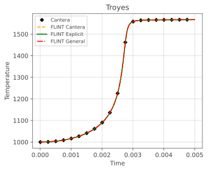
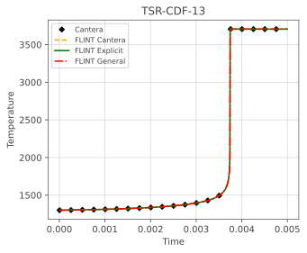
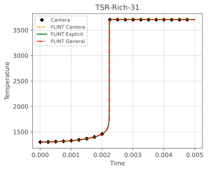
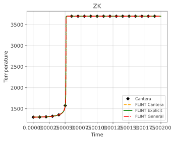

# FLINT Test Suite Documentation

FLINT capabilites are tested by means of a group of small programs. In particular, the test suite aims to verify thermodynamic properties, chemical source terms, batch reactor integration, and chemical equilibrium calculations. In addition, it provides systematic verification of the integrated chemical mechanisms.

Where available, Cantera is used as a reference implementation.

Note that the tests serve both as regression tools during development and as practical examples for users.

---

## Thermodynamic Properties

**Purpose**

Benchmark and verify the computation of the **specific heat at constant pressure** (`cp`) for ideal gas mixtures.

**Description**

This test compares:

* **FLINT native thermodynamic routines**
* **Cantera thermodynamic routines**

The benchmark evaluates both **numerical agreement** and **computational performance** over a wide temperature range.

**Simulation Modes**

The test must be executed from the `./test` directory, where the chemical mechanism data are located.
From a shell, run:
```
./../bin/test/test-thermo
```

**Test Procedure**

1. Load ideal-gas thermodynamic data.
2. Load the same mechanism into Cantera from.
3. Define a fixed gas mixture.
4. Loop over temperatures.
5. Compute thermodynamic properties.
6. Measure:
   * Wall-clock CPU time
   * Relative error between FLINT and Cantera `cp`

**Output**

* Execution time for FLINT
* Execution time for Cantera
* Relative error (%)

**Verification Criteria**

* Relative error typically below machine precision
* FLINT expected to outperform Cantera in raw throughput

---

## Chemical Source Terms

**Purpose**

Validate and benchmark **species production rates** (`\dot{\omega}`) for mechanisms including **third-body reactions**.

**Description**

This test compares:

* FLINT **explicit chemistry kernel**
* Cantera net production rates

Multiple chemical mechanisms are evaluated.

**Tested Mechanisms**

* Westbrook & Dryer
* Troyes
* Ecker
* Cross
* Pelucchi
* Smooke
* CORIA-CNRS
* TSR-CDF-13
* TSR-GP-24
* TSR-Rich-31

Each mechanism is tested independently using identical initial compositions.

**Simulation Modes**

The test must be executed from the `./test` directory, where the chemical mechanism data are located.
From a shell, run:
```
./../bin/test/test-wdot
```

**Test Procedure**

1. Load thermodynamics and chemistry data.
2. Loop over temperature range
3. Compute:

   * `Chemistry_Source` (FLINT)
   * `getNetProductionRates` (Cantera)
4. Store results for post-processing.

**Output**

For each mechanism:

* `OUTPUT/wdot-explicit.dat` — FLINT results
* `OUTPUT/wdot-cantera.dat` — Cantera results (if enabled)

Each file contains:
```
T  wdot_1  wdot_2  ...  wdot_ns
```

**Verification Criteria**

* Pointwise agreement between FLINT and Cantera

---

## Batch Reactor Integration

**Purpose**

Verify and benchmark **time integration of reacting systems** using FLINT’s ODE solvers.

**Description**

This test integrates a **constant-volume batch reactor** and compares:

* FLINT native RHS
* FLINT–Cantera RHS
* FLINT general (non-coded) chemistry RHS

Both **accuracy** and **performance** are evaluated.

**Tested Mechanisms**

* Westbrook & Dryer
* Troyes
* Ecker
* Cross
* Pelucchi
* Smooke
* Zhukov & Kong
* CORIA-CNRS
* TSR-CDF-13
* TSR-GP-24
* TSR-Rich-31

**Simulation Modes**

The test must be executed from the `./test` directory, where the chemical mechanism data are located.
From a shell, run:
```
./../bin/test/test-batchF
```

and select the desired simulation mode:

1. **Verification mode**

   * Many time steps
   * Accuracy-focused
2. **Performance mode**

   * Single time step
   * Timing-focused

**Output**

For each mechanism, the following files are written in the `./test/<mechanism>/OUTPUT` directory:

* `batch-general.dat`
* `batch-explicit.dat`
* `batch-cantera.dat` (if enabled)

Each file contains:
```
time  temperature
```

Performance summary files are written in `./test`:

* `comp-batch-general.dat`
* `comp-batch-explicit.dat`
* `comp-batch-canteraFor.dat`

**Verification Criteria**

* Consistent temperature evolution
* Agreement with Cantera within solver tolerances
* Expected speed-up from coded mechanisms

For comparison with Cantera, the C++ test program must be executed to generate the reference results:
```
./../bin/test/test-batchCXX
```

**Results**

Verification results for the different chemical mechanisms are presented in the figures below. The Cantera solutions are compared with those obtained using FLINT for all available modeling approaches, namely the Cantera interface, the general subroutine, and the dedicated explicit routines. As shown, the numerical results exhibit perfect agreement across all cases.

<div class="grid" markdown>

<figure markdown>

<figcaption>Troyes</figcaption>
</figure>

<figure markdown>

<figcaption>Ecker</figcaption>
</figure>

<figure markdown>

<figcaption>Cross</figcaption>
</figure>

<figure markdown>

<figcaption>Pelucchi</figcaption>
</figure>

<figure markdown>

<figcaption>TSR-CDF-13.svg</figcaption>
</figure>

<figure markdown>

<figcaption>TSR-GP-24</figcaption>
</figure>

<figure markdown>

<figcaption>TSR-Rich-31</figcaption>
</figure>

<figure markdown>

<figcaption>Smooke</figcaption>
</figure>

<figure markdown>

<figcaption>CORIA-CNRS</figcaption>
</figure>

<figure markdown>

<figcaption>Zhukov-Kong</figcaption>
</figure>

</div>

---

## Chemical Equilibrium

**Purpose**

Validate the **FLINT equilibrium solver** against Cantera results.

**Description**

This test computes **chemical equilibrium at constant volume** and compares:

* Equilibrium temperature
* Selected species mass fractions

**Tested Mechanisms**

* Westbrook & Dryer
* Zhukov & Kong
* TSR-GP-24
* Ecker

Note that mechanisms are loaded just to have a set of species.

**Simulation Modes**

The test must be executed from the `./test` directory, where the chemical mechanism data are located.
From a shell, run:
```
./../bin/test/test-CEA
```

**Test Procedure**

1. Load thermodynamic data.
2. Define initial composition.
3. Solve equilibrium.
4. Compare results with **precomputed Cantera reference values**.

**Verification Criteria**

* Equilibrium temperature
* Key species mass fraction (e.g. CO, OH)

A test is marked **success** if:

* Solution is finite
* Relative error < 1% compared to Cantera

---

## Summary

The FLINT test suite provides:

* Numerical verification against Cantera
* Performance benchmarks
* Validation across multiple chemical mechanisms

Together, these tests ensure correctness, robustness, and high performance of the FLINT library.
